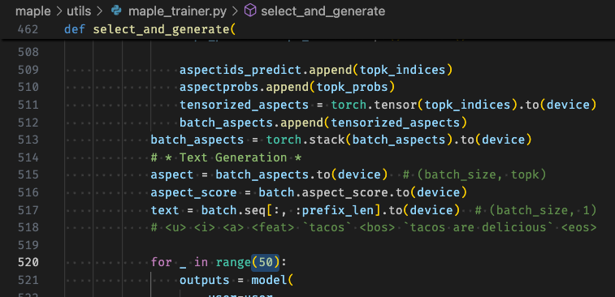

# MAPLE: Enhancing Review Generation with Multi-Aspect Prompt LEarning in Explainable Recommendation


## I. Installation
- Clone the repo
```shell
git clone git@github.com:Nana2929/MAPLE.git
cd MAPLE
```
- Environment setup
```shell
# Python 3.10 or above is recommended
conda create -n maple python=3.10 -c conda-forge
conda activate maple
pip install -r requirements.txt
```
- Notes:
    - Beware of your `torch` version. Installing `torch` that suits your CUDA version is recommended over using the `torch` version in `requirements.txt`. Refer to [PyTorch: Get Started Locally](https://pytorch.org/get-started/locally/).


## II. Prepare Dataset
- [💾 Google Drive](https://drive.google.com/drive/folders/1HTJ0l0by366biqoY_enDppdAMf9oQkaA?usp=sharing)
- [🤗 Huggingface Datasets: IKMLab/maple_nete_format_data](https://huggingface.co/datasets/IKMLab/maple_nete_format_data)
```bash
pip install gdown
gdown --id 1KOHEqr53yx1tuI0mC21pRxY04kloaY1l # find the share link and copy id from within
gdown --id 17bxefjjwXPp0BYqrtBCsashLMhd2YPPG
tar zxvf yelp.tar.gz
tar zxvf yelp23.tar.gz
# They should be extracted to nete_format_data/yelp and nete_format_data/yelp23 respectively
# if not, manually move them to the correct path
```

### Dataset Description
- For detailed dataset preprocessing scripts, see [preprocessing](preprocessing).

|                            | **Yelp19** | **Yelp23** |
|----------------------------|------------|------------|
| \# of users                | 27,147     | 35,152     |
| \# of items                | 20,266     | 24,199     |
| \# of reviews              | 1,293,247  | 1,339,433  |
| \# of features             | 204,117    | 279,636    |
| \# of review segments      | 1,293,247  | 3,079,123  |
| \# of categories           | 18         | 28         |
| avg \# of reviews/user     | 47.64      | 38.10      |
| avg \# of reviews/item     | 63.81      | 55.35      |
| avg \# of segments/review  | 1.0        | 2.298      |

- We follow the [NETE](https://github.com/lileipisces/NETE) format, which is a warm-start scenario.
    - Every user or item in the testing set at least appears in training set once.
 - Training set consists of `user-item-aspect(category)` triplets to an text; testing set consists of `user-item` pair.
    ```
    {'user': '107079727745160443525',
    'item': '6056c839f69c7b1178070165',
    'category': 'Gluten-Free,Vegan,Vegetarian',
    'rating': 4,
    'triplets': [
        ('vegan pizza', 'tasty', 'Tasty , Vegan Pizza', 'positive', 'Gluten-Free,Vegan,Vegetarian'),
        ('topping', 'variety', 'variety of toppings', 'positive', 'location')],
    'text': 'Tasty, Vegan Pizza. A variety of toppings with the option of buying a whole pie or slices.',
    'sentiments': ['positive']}
    ```
## III. Experiment
All MAPLE variants are trained with the same hyperparameters, including the learning rate, batch size, and the number of training epochs in 2 stages. We vary $K$ and the aspect selection strategies only in the inference stage on the same checkpoint.
### 🍁 Training
To get the stats, train MAPLE first with the following command.
```shell
bash scripts/train_maple.sh
```
- Notes:
    - Training MAPLE on 1 fold (with early stop) with an `RTX3090` card on Yelp19 takes 7 to 8 hours; on Yelp23 takes 14 to 16 hours.
    - We use `wandb` to log & monitor the training process. Each run is logged under project `maple-{args.ckptdir}`. Change this in `maple/train_maple.py` if needed. To disable `wandb` logging, pass the environment variable `WANDB_MODE=disabled`.
    - You can change the line `for index in 1 2 3 4 5; do` to, e.g., `for index in 1 ; do` in the script to train on a specific fold. The default is to train all 5 folds.
    - If you would like to change the checkpoint directory name, change `ckptdir`. The trained checkpoint will be saved under `checkpoints/{ckptdir}/{dataset_name}/{fold}`, e.g., `checkpoints/reproduce/yelp/1/model.pt`. You will need this checkpoint for further inference.
    - If you would like to change the target dataset, change `dataset` to e.g., `yelp`, `yelp23`.

- Special Arguments

| Argument                     | Explanation                                                                                                                                                                  |
|------------------------------|------------------------------------------------------------------------------------------------------------------------------------------------------------------------------|
| `--words`                    | Explanation Generation. Number of words to generate for each sample                                                                         |
| `--max_samples`              | Explanation Generation. Max number of test samples to use for inference               |
| `--max_test_aspect_tokens`   | Inference. For testing, at most how many aspect tokens can be used for averaging. This is the $K$ in the paper                                                   |
| `--aspect_select_strategy`   | Inference. How to select aspect tokens for inference, available: `supervised`, `heuristic`, and `gt`                                                                                           |
| `--auto_arg_by_dataset`      | Auto set some arguments by dataset                                                                                                                                            |
| `--model_name`               | Base model name, currently only support `gpt-2`                                                                                                                                |
| `--text_epochs`              | Training. Stage 1 epochs (the period when we only train the text generation task)                                                                                                       |
| `--text_endure_times`        | Training. The maximum endure text-only training epochs of loss increasing on validation                                                                                                 |
| `--epochs`                   | Training. Stage 2 epochs (the period when we train both text-gen and aspect selection)                                                                                                  |
| `--endure_times`             | Training. The maximum endure epochs of loss increasing on validation                                                                                                                    |
| `--text_reg`                 | Training. Regularization on text generation task                                                                                                                                        |
| `--aspect_rating_reg`        | Training. Regularization on aspect selection task                                                                                                                                       |
| `--ckptdir`                  | General. Checkpoint directory name under `checkpoints`                                                                                                                                                           |
### 🍁 Inference
After training, run the following command to evaluate the model.
```shell
bash scripts/inference_supervised_maple.sh        # S@1, S@2, S@3, S@4
bash scripts/inference_heuristic_maple.sh         # Heuristic@3
bash scripts/inference_gt_maple.sh                # GT@1
```
- For `MAPLE-GT`, the script ignores `--max_test_aspect_tokens` ($K$) and uses only **one** ground-truth aspect token for the user-item pair.
### 🍁 Evaluation
You should find filenames in L#8 to L#11 in the script below, which are the paths to the inference results. Run the script below to evaluate any of them.
```bash
bash scripts/score_maple.sh
```
you should find the scores under `./checkpoints/reproduce/{dataset_name}/{fold}/score_outputs`. For example:
```bash
./checkpoints/reproduce/yelp/1/score_outputs
├── maple_supervised_k=1.csv                  # for `iFMR, iFCR, GT-FMR`
├── maple_supervised_k=1_FCR.csv              # for 4 quartiles of `FCR` and overall `FCR`
├── mauve_generated_supervised_k=1.log        # see `mauve=` in the log
└── scores_input=generated_supervised_k=1.csv # for `USR, uUSR, iUSR, D-2, D-3, ENTR`
```
### How to get the statistics in the thesis/paper
- Experiment 5.1, 5.2
    - Collect the statistics following [evaluation](#evaluation).
- 5.3 Explainability of Aspect Prompts
    - For table 3, collect from `maple_supervised_k=3_FCR.csv`.
    - For figure 4, see [analysis/tsne.ipynb](analysis/tsne.ipynb) for the t-SNE visualization of the aspect prompts learned by MAPLE.
- 5.4 MAPLE as a Discrete Retriever
    - Step 1. Encode the ground-truth and generated explanations. You can change the `--input_filepath` to the path of any generated explanation file.
    This command creates an `embeds` directory at the same level of the `--input_filepath`.
    ```bash
    python3 metrics/chores/query_to_embeds.py --input_filepath="./checkpoints/reproduce/yelp/1/generated_supervised_k=3.jsonl"
    ```
    - Step 2. Calculate the cosine similarity and MSE loss between them. Pass the embedding directory created from step 1. to argument `--embeds_dir`. The results (scores) will be logged into console.
    ```bash
    python3 metrics/prag/run_latent_maple.py --embeds_dir="./checkpoints/reproduce/yelp/1/embeds"
    ```
- Appendix C.2
    - For verifying the inference speed claimed ("This adds only 0.02s latency per batch of 200 samples,..."), because MAPLE defaults to generate 50 tokens and trim the remaining after the first `<EOS>`, one needs to change `maple/utils/maple_trainer.py` L#520 and L#605 to peek the ground-truth length information so that the generation target length is consistent for all baselines. Hence the measured speed is accurate.
    
## IV. Citation
Kindly cite us if you use our code or data.
https://aclanthology.org/2025.acl-long.1535/
```
@inproceedings{yang-etal-2025-maple,
    title = "{MAPLE}: Enhancing Review Generation with Multi-Aspect Prompt {LE}arning in Explainable Recommendation",
    author = "Yang, Ching-Wen  and
      Feng, Zhi-Quan  and
      Lin, Ying-Jia  and
      Chen, Che Wei  and
      Wu, Kun-da  and
      Xu, Hao  and
      Jui-Feng, Yao  and
      Kao, Hung-Yu",
    editor = "Che, Wanxiang  and
      Nabende, Joyce  and
      Shutova, Ekaterina  and
      Pilehvar, Mohammad Taher",
    booktitle = "Proceedings of the 63rd Annual Meeting of the Association for Computational Linguistics (Volume 1: Long Papers)",
    month = jul,
    year = "2025",
    address = "Vienna, Austria",
    publisher = "Association for Computational Linguistics",
    url = "https://aclanthology.org/2025.acl-long.1535/",
    doi = "10.18653/v1/2025.acl-long.1535",
    pages = "31803--31821",
    ISBN = "979-8-89176-251-0",
    abstract = "Explainable Recommendation task is designed to receive a pair of user and item and output explanations to justify why an item is recommended to a user. Many models approach review generation as a proxy for explainable recommendations. While these models can produce fluent and grammatically correct sentences, they often lack preciseness and fail to provide personalized informative recommendations. To address this issue, we propose a personalized, aspect-controlled model called Multi-Aspect Prompt LEarner (MAPLE), which integrates aspect category as another input dimension to facilitate memorizing fine-grained aspect terms. Experiments conducted on two real-world review datasets in the restaurant domain demonstrate that MAPLE significantly outperforms baseline review-generation models. MAPLE excels in both text and feature diversity, ensuring that the generated content covers a wide range of aspects. Additionally, MAPLE delivers good generation quality while maintaining strong coherence and factual relevance. The code and dataset used in this paper can be found at https://github.com/Nana2929/MAPLE."
}
```

## V. Acknowledgement
- This work was supported and funded by the **Google Pixel Research Team**.
- We thank **Li, Lei, Yongfeng Zhang, and Li Chen** for their previous works, public codebase and datasets.
    - Li, Lei, Yongfeng Zhang, and Li Chen. "Generate neural template explanations for recommendation." Proceedings of the 29th ACM International Conference on Information & Knowledge Management. 2020.
- We thank **Tong Wu et al.** for making their code public.
    - Wu, Tong, et al. "Distribution-balanced loss for multi-label classification in long-tailed datasets." Computer Vision–ECCV 2020: 16th European Conference, Glasgow, UK, August 23–28, 2020, Proceedings, Part IV 16. Springer International Publishing, 2020.
