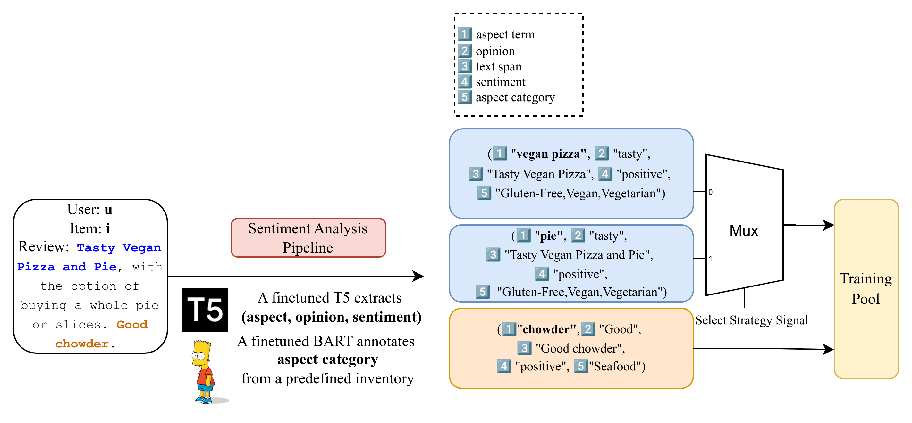

# MAPLE: Data Processing Pipeline
## Disclaimer
This project is a copy of [Nana2929/enrich_rec_dataset](https://github.com/Nana2929/enrich_rec_dataset).
This is documented only for myself to understand the project. For future researcher, you may need to
study into the project from my paper [MAPLE](https://arxiv.org/abs/2408.09865), below `README.md` and my codebase.

## Dataset Description
<!-- - GEST
    - raw data [link](https://drive.google.com/drive/folders/1lMyaUW8VgXEojpjiMMrt-VC5uPeZ3al0)
```
./Gest # https://drive.google.com/drive/folders/1lMyaUW8VgXEojpjiMMrt-VC5uPeZ3al0
├── Google-data
│   ├── filter_all_t # after this pipeline
│   │   ├── aspect_classify
│   │   ├── gest_reviews_uie
│   │   ├── gest_reviews_uie_&
│   │   ├── gest_reviews_uie_final
│   │   ├── test_uie.log
│   │   ├── train_uie.log
│   │   └── val_uie.log
│   ├── filter_all_t.json  # raw reviews, Gest-s2 subset
│   ├── image_review_all.json # not used
│   └── readme.md
└── images
    └── AF1Qip ...

``` -->

### Yelp'19 (Yelp)
- [data source](https://lifehkbueduhk-my.sharepoint.com/personal/16484134_life_hkbu_edu_hk/_layouts/15/onedrive.aspx?id=%2Fpersonal%2F16484134%5Flife%5Fhkbu%5Fedu%5Fhk%2FDocuments%2FCIKM20%2DNETE%2DDatasets&ga=1) or access through [lileipisces/NETE](https://github.com/lileipisces/NETE?tab=readme-ov-file)
### Yelp'23
- raw data [link](https://www.yelp.com/dataset)
- **Disclaimer**: The data will be updated as time passes, and it is possible that the data content will be different from the data used in the paper. The data used in the paper is the data downloaded on around 2023/11/30.
```
./yelp_2023
├── yelp_2023_pruned
│   ├── aspect_classify
│   │   ├── aspect2category_#481222.pkl
│   │   ├── aspect_classify.log
│   │   ├── aspect_set.pkl
│   │   ├── aspect_set_union.pkl
│   │   └── aspect_split&_yelp23.log
│   ├── yelp_academic_dataset_business_pruned.json
│   ├── yelp_academic_dataset_review_pruned.json
│   ├── yelp_academic_dataset_review_pruned_uie
│   │   ├── yelp_2023_uie.log
│   │   ├── yelp_reviews_uie.pkl
│   │   └── yelp_reviews_uie_&.pkl
│   └── yelp_academic_dataset_user_pruned.json
└── yelp_2023_raw
    ├── Dataset_User_Agreement.pdf
    ├── photos.json
    ├── yelp_academic_dataset_business.json
    ├── yelp_academic_dataset_checkin.json
    ├── yelp_academic_dataset_review.json
    ├── yelp_academic_dataset_tip.json
    ├── yelp_academic_dataset_user.json
    ├── yelp_dataset.tar
    └── yelp_photos.tar
```

## Sentiment Analysis Pipeline

- Environment Setup: `Python 3.9` or above (for natural `Typing`).
### 1. Pruning
- Only `yelp'23` needs to run this step.
- The idea is to prune the dataset to `{MIN_DEGREE}-core`(every user and item has at least `MIN_DEGREE` reviews, we use `MIN_DEGREE=10` in the paper as suggested in NETE) and remove the reviews that are not in the core.
```bash
process_yelp23/nete_process.py --yelp_dir="/home/P76114511/projects/yelp_2023/yelp_2023_raw"
```
### 2. Sentiment Triplet Extraction
- This step is done by first finetuning the `uie-large-en` on sentiment datasets, then use the checkpoint to extract the triplets from the reviews.
- Before this step, we need to partition the reviews into batches of reviews so that if we accidentally stop the annotation, we can resume from the last batch.

```bash
# run finetuning
bash UIE/run_uie_finetune.bash # 9103 server
# the finetuned ckpt saved @/home/P76114511/projects/checkpoints/uie_finetune_checkpoints/run1
# use the checkpoint to extract triplets
# run partitionining for each dataset
python3 process/partition_yelp.py
python3 process/partition_gest.py
# uncomment the lines for the corresponding datasets in the below script
bash scripts/run_uie_analyze.sh
# run postprocessing to extract the triplets from the annotation
python3 posprocess_uie.py --auto-arg_by_dataset=yelp # or gest
```
### 3. Aspect Category Classification
- Done by BART.
- This step is to classify the aspect to pre-defined aspect categories. For detailed category list, see `resources/predefined_aspect_categories.py`. Categories such as `ambience`, `service` are classified first,
if the classified aspect category is `food&drinks`, we further use Yelp's predefined categories to classify into more fine-grained classes.
```bash
bash scripts/run_aspect_classify.sh
```
### 4. Convert to NETE format.
```bash
python3 convert_gest_nete.py
python3 convert_yelp_nete.py
```

## Example
```
{'user': '107079727745160443525',
 'item': '6056c839f69c7b1178070165',
 'category': 'Gluten-Free,Vegan,Vegetarian',
 'rating': 4,
 'template': (['vegan pizza'],
  '',
  'Tasty , Vegan Pizza',
  1.0,
  'Gluten-Free,Vegan,Vegetarian'),
 'triplets': [('vegan pizza',
   'tasty',
   'Tasty , Vegan Pizza',
   'positive',
   'Gluten-Free,Vegan,Vegetarian'),
  ('topping', 'variety', 'variety of toppings', 'positive', 'location')],
 'text': 'Tasty, Vegan Pizza. A variety of toppings with the option of buying a whole pie or slices.',
 'pics': ['AF1QipN_OR-i_KAYcaI3DU4KMfIimt-ylAkuKzuMP-xk'],
 'tokens': ['Tasty',
  ',',
  'Vegan',
  'Pizza',
  '.',
  'A',
  'variety',
  'of',
  'toppings',
  'with',
  'the',
  'option',
  'of',
  'buying',
  'a',
  'whole',
  'pie',
  'or',
  'slices',
  '.'],
 'sentiments': ['positive']}
```

